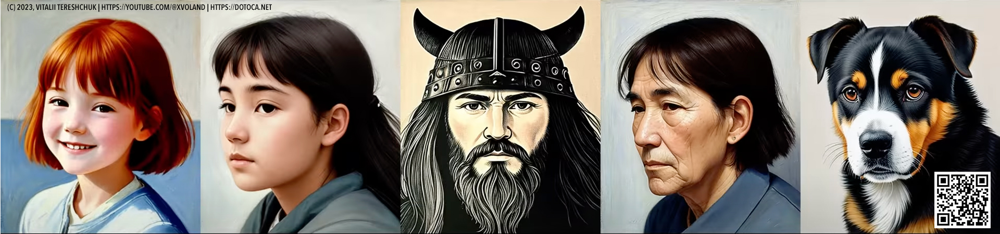
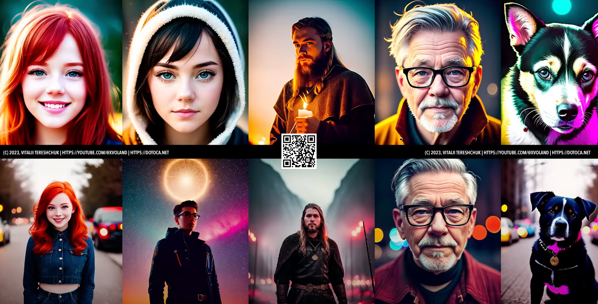

# Artists changing style

*This is a set of artists and photographers with examples to get a similar result in Stable Diffusion by adding style.*

### Agnes Martin

```Prompt: canvas, detailed by Agnes Martin``` for BG


```Prompt: (art by Agnes Martin:1.2)``` for IMG


### Jacob Hashimoto


```Sampler: DPM++ 2M KARRAS```


```Prompt: Jacob Hashimoto on bg```


### Stanley Donwood (Dan Rickwood)


```Dan Rickwood```


### Julie Mehretu


```Prompt: eclectic```


### Quentin Blake


```Prompt: punk by Quentin Blake```


### David Palumbo


### Phil Jimenez


### Geof Darrow


### Nicola Samori


### Ben Templesmith


### Brandon Woelfel



```Prompt: low key, lit```


### Viviane Sassen


```Prompt: detailed```


### Brian Oldham


### Lisa Frank


### Simon Stalenhag


### Iryna Yermolova


```Additional Prompt: Irina Yermolova```


### Todd Schorr


### Alayna Lemmer


### Andre-Charles Boulle


### Conor Harrington


``` Graffithi style: Carne Griffiths ```


### Wangechi Mutu


### Erin Babnik

 


## Other

```amigurumi``` - get everything knitted

```baroque + rococo style``` - good for streets

```dadism + surrealism style``` - good for portrets

```gothic + art deco``` - good for portrets

```abstract expressionism + minimalism``` - decor of the room and other


## License

&copy; 2023, [Vitalii Tereshchuk][home] | [Youtube][youtube]
<br />


[home]: http://dotoca.net

[paypal]: https://paypal.me/xvoland

[youtube]: https://youtube.com/@xvoland

[instagram]: https://www.instagram.com/xvoland/
