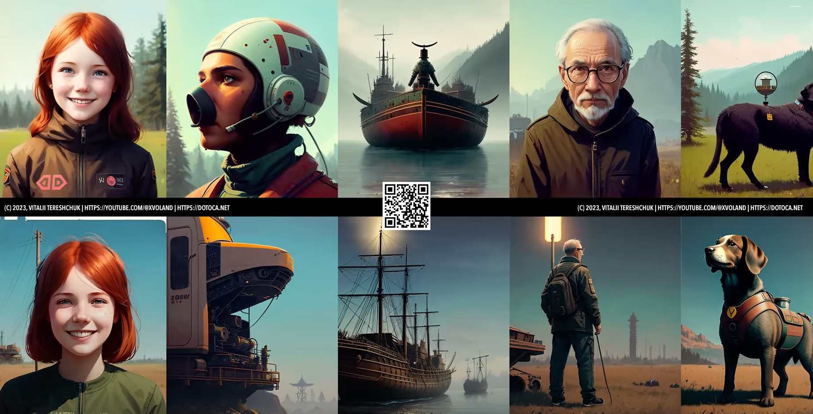

# Artists changing style

*This is a set of artists and photographers with examples to get a similar result in Stable Diffusion by adding style.*

### Agnes Martin

```Prompt: canvas, detailed by Agnes Martin``` for BG


```Prompt: (art by Agnes Martin:1.2)``` for IMG


### Jacob Hashimoto


```Sampler: DPM++ 2M KARRAS```


```Prompt: Jacob Hashimoto on bg```


### Stanley Donwood (Dan Rickwood)


```Dan Rickwood```


### Julie Mehretu


```Prompt: eclectic```


### Quentin Blake


```Prompt: punk by Quentin Blake```


### David Palumbo


### Phil Jimenez


### Geof Darrow


### Nicola Samori


### Ben Templesmith


### Brandon Woelfel


```Prompt: low key, lit```


### Viviane Sassen


```Prompt: detailed```


### Brian Oldham


### Lisa Frank


### Simon Stalenhag




### Iryna Yermolova


```Additional Prompt: Irina Yermolova```


### Todd Schorr


### Alayna Lemmer


### Andre-Charles Boulle


### Conor Harrington


``` Graffithi style: Carne Griffiths ```


### Wangechi Mutu


### Patrick Dougherty


### by Erin Babnik

```by Erin Babnik```

 


### Ali Erturk

HDR Photo

 

### Jimmy Chin

```Extreme photos```

  


### art by J.C. Leyendecker

```
European airline stewardess, sexy, vintage, 
art by J.C. Leyendecker
```


### Aesthetic design

```
(2d,line art,monochrome,flat color,white tone,Hatching, black and white:1.5), masterpiece, aesthetic, extremely beautiful, realistic, A room in a modern European condominium BREAK
```

 

## Other

```European woman, (floral embroidery, floral print, pointing), studio photo``` - flowers

```amigurumi``` - get everything knitted

```baroque + rococo style``` - good for streets

```dadism + surrealism style``` - good for portrets

```gothic + art deco``` - good for portrets

```abstract expressionism + minimalism``` - decor of the room and other

## Midjourney

Prompt: ```(foggy background, epic realistic, intricate details, hyperdetailed, cinematic, muted colors:1.3), (8k, best quality, masterpiece, symmetry, ultra highres:1.2)```

```RGB(15, 19, 22)``` for background


## Art

```
J Scott Campbell style, art by Johan Potma, potma style, <lora:Johan_Potma_Art_Style_SDXL:2>
```


## 3D Art

3D isometric rendering of **[Your monument]**, with a next-gen video game quality. The monument is highlighted against a pure white background, intricate details and realistic textures.


## Pig Art

```
full body portait, Oil on canvas, charcoal, pastels, soft impressionistic brush strokes, Edgar Degas, Mary Blair, Mark Ryden, Ray Caesar, Fragonard. surreal, fantastical, Insanely detailed colorful portrait adorable chubby gentleman, boar face, wild boar tusks, pig hands, curls, sharp eyes, exquisite haunted mansion interior. Deep rich colors.<lora:xl_more_art-full_v1:0.5>
```


## License

&copy; 2023, [Vitalii Tereshchuk][home] | [Youtube][youtube]
<br />


[home]: http://dotoca.net

[paypal]: https://paypal.me/xvoland

[youtube]: https://youtube.com/@xvoland

[instagram]: https://www.instagram.com/xvoland/
